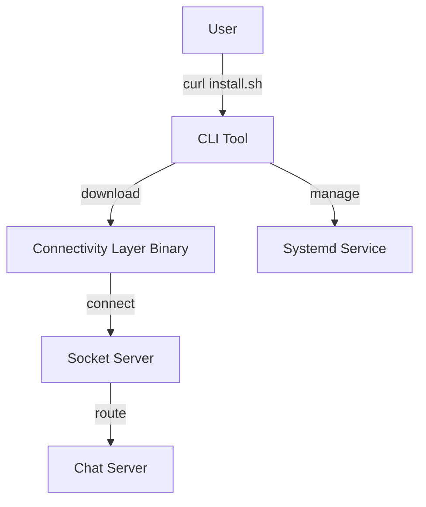

# Fixpanic CLI Tool Implementation Plan

## Project Overview
The Fixpanic CLI tool is a Go-based command-line interface for deploying and managing the connectivity layer (fixpanic-agent) on customer servers. It uses the Cobra framework for command structure and provides binary distribution for Linux, macOS, and Windows.

## Architecture



## Project Structure

```
microservices/cli-tool/
├── cmd/
│   ├── root.go           # Root command definition
│   ├── agent/
│   │   ├── install.go    # Agent installation command
│   │   ├── start.go      # Agent start command
│   │   ├── stop.go       # Agent stop command
│   │   ├── status.go     # Agent status command
│   │   ├── uninstall.go  # Agent uninstall command
│   │   ├── test.go       # Connection testing
│   │   ├── validate.go   # Security rules validation
│   │   └── logs.go       # Log viewing
├── internal/
│   ├── config/           # Configuration management
│   ├── connectivity/     # Connectivity layer management
│   ├── service/          # Systemd service management
│   ├── platform/         # Platform-specific operations
│   └── utils/            # Utility functions
├── scripts/
│   ├── install.sh        # Bash installation script
│   └── build.sh          # Build script
├── go.mod                # Go module definition
├── main.go               # Main entry point
└── README.md             # Documentation
```

## Core Commands

### 1. Agent Install
```bash
fixpanic agent install --agent-id="agent_123" --api-key="fp_abc123xyz"
```
- Downloads connectivity layer binary
- Creates configuration file
- Sets up systemd service
- Starts the service

### 2. Agent Management
```bash
fixpanic agent start      # Start the agent service
fixpanic agent stop       # Stop the agent service
fixpanic agent status     # Check agent status
fixpanic agent uninstall  # Remove agent completely
```

### 3. Development Commands
```bash
fixpanic agent test-connection  # Test connectivity to socket server
fixpanic agent validate-rules   # Validate security rules
fixpanic agent logs             # View agent logs
```

## Configuration Management

### Agent Configuration File (`/etc/fixpanic/agent.yaml`)
```yaml
agent:
  id: "agent_123"
  api_key: "fp_abc123xyz"
  socket_server: "socket.fixpanic.com:8080"
  
security:
  rules_file: "/etc/fixpanic/security-rules.yaml"
  
logging:
  level: "info"
  file: "/var/log/fixpanic/agent.log"
```

## Connectivity Layer Management

### Binary Distribution
- Download URL: `https://releases.fixpanic.com/connectivity/latest/connectivity-{os}-{arch}`
- Supported platforms: Linux (amd64, arm64), macOS (amd64, arm64), Windows (amd64)
- Binary location: `/usr/local/lib/fixpanic/connectivity`

### Version Management
- Check for updates periodically
- Support rollback to previous versions
- Verify binary signatures for security

## Service Management

### Systemd Service (`/etc/systemd/system/fixpanic-agent.service`)
```ini
[Unit]
Description=Fixpanic Agent
After=network.target

[Service]
Type=simple
User=fixpanic
ExecStart=/usr/local/lib/fixpanic/connectivity --config /etc/fixpanic/agent.yaml
Restart=always
RestartSec=10

[Install]
WantedBy=multi-user.target
```

## Installation Script

### Bash Installation Script (`scripts/install.sh`)
```bash
#!/bin/bash
# Universal installer for Fixpanic CLI
# Features:
# - Platform detection (OS/architecture)
# - Permission handling (root vs user)
# - PATH configuration
# - Installation verification
# - Error handling and rollback
```

## Build and Distribution

### GitHub Actions Workflow
- Cross-platform builds (Linux, macOS, Windows)
- Automated releases on git tags
- Binary signing for enterprise deployment
- CDN distribution setup

### Release Channels
- `latest`: Latest stable release
- `stable`: Production-ready releases
- `beta`: Pre-release versions

## Security Considerations

1. **Binary Verification**: Verify signatures of downloaded binaries
2. **API Key Security**: Secure storage of agent credentials
3. **Permission Management**: Proper file permissions and user privileges
4. **Network Security**: Secure connections to socket server
5. **Rule Validation**: Validate security rules before deployment

## Testing Strategy

1. **Unit Tests**: Command logic and utility functions
2. **Integration Tests**: End-to-end deployment scenarios
3. **Platform Tests**: Multi-platform compatibility
4. **Security Tests**: Permission and authentication testing

## Implementation Phases

### Phase 1: Core CLI Structure
- Set up Go project with Cobra
- Implement basic command structure
- Create configuration management

### Phase 2: Agent Management
- Implement install/start/stop/status commands
- Add connectivity layer binary management
- Create service management functionality

### Phase 3: Advanced Features
- Add testing and validation commands
- Implement update mechanisms
- Create comprehensive error handling

### Phase 4: Distribution
- Build installation script
- Set up GitHub Actions
- Create release infrastructure

## Next Steps
1. Switch to Code mode to implement the Go CLI
2. Start with project structure and main.go
3. Implement core commands incrementally
4. Add comprehensive testing
5. Create distribution infrastructure