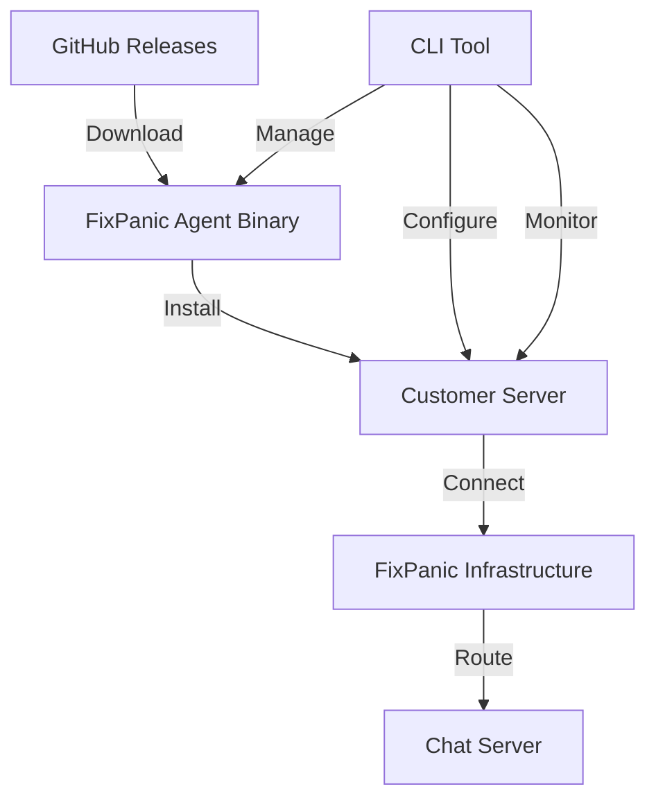

# FixPanic Agent Binary Installation Guide

## Overview

This guide provides comprehensive instructions for installing the FixPanic Agent binary, which is distributed via GitHub Releases. The agent enables secure connectivity between customer servers and the FixPanic infrastructure.

## Architecture



## Installation Methods

### Method 1: Quick Install Script (Recommended)

```bash
# Download and run the official installation script
curl -fsSL https://raw.githubusercontent.com/fixpanic/fixpanic-agent/main/install.sh | bash

# Or with specific version
curl -fsSL https://raw.githubusercontent.com/fixpanic/fixpanic-agent/main/install.sh | bash -s -- --version v1.2.3
```

### Method 2: Direct Binary Download

```bash
# Detect your platform
OS=$(uname -s | tr '[:upper:]' '[:lower:]')
ARCH=$(uname -m)
if [ "$ARCH" = "x86_64" ]; then ARCH="amd64"; fi

# Download binary directly
BINARY_NAME="fixpanic-agent"
DOWNLOAD_URL="https://github.com/fixpanic/fixpanic-agent/releases/latest/download/fixpanic-agent-${OS}-${ARCH}"

# Download and make executable
curl -L -o $BINARY_NAME $DOWNLOAD_URL
chmod +x $BINARY_NAME

# Verify installation
if [ -f "$BINARY_NAME" ]; then
    echo "FixPanic Agent installed successfully!"
    ./$BINARY_NAME --version
else
    echo "Installation failed"
    exit 1
fi
```

### Method 3: Manual Installation with Verification

```bash
#!/bin/bash
set -euo pipefail

# Configuration
GITHUB_REPO="fixpanic/fixpanic-agent"
BINARY_NAME="fixpanic-agent"
INSTALL_DIR="/usr/local/bin"
USER_INSTALL_DIR="$HOME/.local/bin"

# Platform detection
detect_platform() {
    OS="$(uname -s | tr '[:upper:]' '[:lower:]')"
    ARCH="$(uname -m)"
    
    case "$ARCH" in
        x86_64|amd64) ARCH="amd64" ;;
        aarch64|arm64) ARCH="arm64" ;;
        armv7*) ARCH="arm" ;;
        i386|i686) ARCH="386" ;;
        *) echo "Unsupported architecture: $ARCH"; exit 1 ;;
    esac
    
    ARTIFACT_NAME="fixpanic-agent-${OS}-${ARCH}"
}

# Download with verification
download_and_verify() {
    detect_platform
    
    DOWNLOAD_URL="https://github.com/${GITHUB_REPO}/releases/latest/download/${ARTIFACT_NAME}"
    TEMP_FILE="/tmp/${BINARY_NAME}-$$"
    
    echo "Downloading from: $DOWNLOAD_URL"
    
    # Download binary
    if ! curl -L -o "$TEMP_FILE" "$DOWNLOAD_URL"; then
        echo "Download failed. Check network connectivity and release availability."
        exit 1
    fi
    
    # Verify download
    if [ ! -s "$TEMP_FILE" ]; then
        echo "Downloaded file is empty"
        exit 1
    fi
    
    # Make executable
    chmod +x "$TEMP_FILE"
    
    # Test binary
    if ! "$TEMP_FILE" --version >/dev/null 2>&1; then
        echo "Binary verification failed"
        exit 1
    fi
    
    echo "Binary downloaded and verified successfully"
}

# Install binary
install_binary() {
    download_and_verify
    
    # Determine installation directory
    if [ -w "$INSTALL_DIR" ]; then
        TARGET_DIR="$INSTALL_DIR"
    else
        TARGET_DIR="$USER_INSTALL_DIR"
        mkdir -p "$TARGET_DIR"
    fi
    
    # Move to final location
    mv "$TEMP_FILE" "${TARGET_DIR}/${BINARY_NAME}"
    
    echo "FixPanic Agent installed to: ${TARGET_DIR}/${BINARY_NAME}"
    echo "Version: $(${TARGET_DIR}/${BINARY_NAME} --version)"
}
```

## Supported Platforms

| Platform | Architecture | Binary Name | Download URL |
|----------|-------------|-------------|---------------|
| Linux    | amd64       | fixpanic-agent-linux-amd64 | `linux-amd64` |
| Linux    | arm64       | fixpanic-agent-linux-arm64 | `linux-arm64` |
| Linux    | 386         | fixpanic-agent-linux-386   | `linux-386`   |
| Linux    | arm         | fixpanic-agent-linux-arm   | `linux-arm`   |
| macOS    | amd64       | fixpanic-agent-darwin-amd64 | `darwin-amd64` |
| macOS    | arm64       | fixpanic-agent-darwin-arm64 | `darwin-arm64` |
| Windows  | amd64       | fixpanic-agent-windows-amd64.exe | `windows-amd64` |

## Configuration After Installation

### 1. Create Configuration File

The FixPanic Agent requires a YAML configuration file with the following structure:

```yaml
agent:
  id: "your-agent-id"           # Unique agent identifier
  api_key: "your-api-key"       # API authentication key
logging:
  level: "info"                 # Log level (debug, info, warn, error)
  file: "/var/log/fixpanic/agent.log"  # Log file path
```

### 2. Configuration File Locations

Create configuration files at these platform-specific paths:

**Root user installation:**
```bash
sudo mkdir -p /etc/fixpanic
sudo tee /etc/fixpanic/agent.yaml > /dev/null <<EOF
agent:
  id: "agent_$(hostname)"
  api_key: "fp_your_api_key_here"
logging:
  level: "info"
  file: "/var/log/fixpanic/agent.log"
EOF
sudo chmod 600 /etc/fixpanic/agent.yaml
```

**Non-root user installation:**
```bash
mkdir -p ~/.config/fixpanic
cat > ~/.config/fixpanic/agent.yaml <<EOF
agent:
  id: "agent_$(hostname)"
  api_key: "fp_your_api_key_here"
logging:
  level: "info"
  file: "~/.local/log/fixpanic/agent.log"
EOF
chmod 600 ~/.config/fixpanic/agent.yaml
```

### 3. Run the Agent

Start the agent with the configuration file:

```bash
# Standard execution
fixpanic-agent --config /etc/fixpanic/agent.yaml

# With optional log level
fixpanic-agent --config /etc/fixpanic/agent.yaml --log-level debug

# Version check
fixpanic-agent --version
```

## Security Considerations

### Binary Verification
```bash
# Download checksum file
curl -L -o fixpanic-agent.sha256 https://github.com/fixpanic/fixpanic-agent/releases/latest/download/fixpanic-agent.sha256

# Verify binary integrity
sha256sum -c fixpanic-agent.sha256

# Expected output: fixpanic-agent: OK
```

### File Permissions
```bash
# Set appropriate permissions
chmod 755 /usr/local/bin/fixpanic-agent
chmod 600 /etc/fixpanic/agent.yaml

# Verify ownership
chown root:root /usr/local/bin/fixpanic-agent
chown root:root /etc/fixpanic/agent.yaml
```

### API Key Security
- API keys are automatically masked in logs
- Configuration files should have 0600 permissions
- Never commit API keys to version control
- Use environment variables for sensitive data when possible

## Error Handling

### Common Installation Errors

#### Unsupported Platform
```bash
SUPPORTED_PLATFORMS=("linux-amd64" "linux-arm64" "darwin-amd64" "windows-amd64")

if [[ ! " ${SUPPORTED_PLATFORMS[*]} " =~ " ${OS}-${ARCH} " ]]; then
    echo "Error: Unsupported platform ${OS}-${ARCH}"
    echo "Supported platforms: ${SUPPORTED_PLATFORMS[*]}"
    exit 1
fi
```

#### Network Connectivity Issues
```bash
# Test download URL accessibility
if ! curl -I -s -f "https://github.com/fixpanic/fixpanic-agent/releases/latest" > /dev/null; then
    echo "Error: Cannot reach GitHub releases"
    echo "Please check your internet connection and proxy settings"
    exit 1
fi
```

#### Permission Denied
```bash
# Check write permissions
if [ ! -w "/usr/local/bin" ] && [ ! -w "$HOME/.local/bin" ]; then
    echo "Error: No write permissions for installation directories"
    echo "Try running with sudo or ensure you have write access to installation directory"
    exit 1
fi
```

#### Binary Execution Issues
```bash
# Check binary compatibility
if ! file fixpanic-agent | grep -q "executable"; then
    echo "Error: Binary is not executable"
    echo "This might be due to architecture mismatch"
    exit 1
fi
```

## Configuration Validation

### Required Parameters
The agent will exit with clear error messages if:

1. **Missing --config flag**
   ```bash
   Error: --config flag is required
   Solution: Always provide the --config flag
   fixpanic-agent --config /etc/fixpanic/agent.yaml
   ```

2. **Configuration file doesn't exist**
   ```bash
   Error: failed to read config file /path/to/config.yaml: open /path/to/config.yaml: no such file or directory
   Solution: Ensure the configuration file exists at the specified path
   ls -la /etc/fixpanic/agent.yaml
   ```

3. **Invalid YAML syntax**
   ```bash
   Error: failed to parse config file /etc/fixpanic/agent.yaml: error converting YAML to JSON
   Solution: Validate YAML syntax using online tools or yaml lint
   ```

4. **Missing required fields**
   ```bash
   Error: invalid configuration: agent ID is required
   Error: invalid configuration: agent API key is required
   Solution: Ensure all required fields are present in the configuration file
   ```

## Troubleshooting

### Download Issues
```bash
# Check if release exists
curl -I https://github.com/fixpanic/fixpanic-agent/releases/latest

# List available assets
curl -s https://api.github.com/repos/fixpanic/fixpanic-agent/releases/latest | \
  grep "browser_download_url" | cut -d '"' -f 4

# Try alternative download methods
wget https://github.com/fixpanic/fixpanic-agent/releases/latest/download/fixpanic-agent-${OS}-${ARCH}
```

### Permission Issues
```bash
# Ensure binary has execute permissions
chmod +x fixpanic-agent

# Check file ownership
ls -la fixpanic-agent

# Verify installation directory permissions
ls -ld /usr/local/bin
ls -ld $HOME/.local/bin
```

### Service Management Issues
```bash
# Check systemd service status
sudo systemctl status fixpanic-agent

# View service logs
sudo journalctl -u fixpanic-agent -n 50

# Manual service control
sudo systemctl start fixpanic-agent
sudo systemctl stop fixpanic-agent
sudo systemctl restart fixpanic-agent
```

### Configuration Issues
```bash
# Validate configuration syntax
yamllint /etc/fixpanic/agent.yaml

# Test configuration without starting agent
fixpanic-agent --config /etc/fixpanic/agent.yaml --version

# Check file permissions
ls -la /etc/fixpanic/agent.yaml

# Verify log directory exists
ls -la /var/log/fixpanic/
```

## Advanced Usage

### Environment Variables
```bash
# Override configuration with environment variables
export FIXPANIC_AGENT_ID="agent_custom_id"
export FIXPANIC_API_KEY="fp_custom_api_key"
export FIXPANIC_LOG_LEVEL="debug"

fixpanic-agent --config /etc/fixpanic/agent.yaml
```

### Multiple Agent Instances
```bash
# Run multiple agents with different configurations
fixpanic-agent --config /etc/fixpanic/agent-1.yaml
fixpanic-agent --config /etc/fixpanic/agent-2.yaml
```

### Debugging
```bash
# Enable debug logging
fixpanic-agent --config /etc/fixpanic/agent.yaml --log-level debug

# Run in foreground with verbose output
fixpanic-agent --config /etc/fixpanic/agent.yaml --verbose

# Test connectivity
fixpanic-agent --config /etc/fixpanic/agent.yaml --test-connection
```

## Integration Examples

### Docker Installation
```dockerfile
FROM alpine:latest

# Install curl
RUN apk add --no-cache curl

# Download and install FixPanic Agent
RUN curl -L -o fixpanic-agent \
    https://github.com/fixpanic/fixpanic-agent/releases/latest/download/fixpanic-agent-linux-amd64 && \
    chmod +x fixpanic-agent && \
    mv fixpanic-agent /usr/local/bin/

# Copy configuration
COPY agent.yaml /etc/fixpanic/agent.yaml

# Run agent
CMD ["fixpanic-agent", "--config", "/etc/fixpanic/agent.yaml"]
```

### Ansible Playbook
```yaml
---
- name: Install FixPanic Agent
  hosts: servers
  become: yes
  
  tasks:
    - name: Download FixPanic Agent
      get_url:
        url: "https://github.com/fixpanic/fixpanic-agent/releases/latest/download/fixpanic-agent-linux-amd64"
        dest: /usr/local/bin/fixpanic-agent
        mode: '0755'
        owner: root
        group: root
    
    - name: Create configuration directory
      file:
        path: /etc/fixpanic
        state: directory
        mode: '0755'
    
    - name: Create configuration file
      template:
        src: agent.yaml.j2
        dest: /etc/fixpanic/agent.yaml
        mode: '0600'
        owner: root
        group: root
    
    - name: Create systemd service
      template:
        src: fixpanic-agent.service.j2
        dest: /etc/systemd/system/fixpanic-agent.service
      notify: reload systemd
    
    - name: Start and enable service
      systemd:
        name: fixpanic-agent
        state: started
        enabled: yes
        
  handlers:
    - name: reload systemd
      systemd:
        daemon_reload: yes
```

### Kubernetes Deployment
```yaml
apiVersion: apps/v1
kind: DaemonSet
metadata:
  name: fixpanic-agent
  namespace: monitoring
spec:
  selector:
    matchLabels:
      app: fixpanic-agent
  template:
    metadata:
      labels:
        app: fixpanic-agent
    spec:
      hostNetwork: true
      containers:
      - name: fixpanic-agent
        image: fixpanic/fixpanic-agent:latest
        args:
        - --config
        - /etc/fixpanic/agent.yaml
        volumeMounts:
        - name: config
          mountPath: /etc/fixpanic
        - name: logs
          mountPath: /var/log/fixpanic
      volumes:
      - name: config
        configMap:
          name: fixpanic-agent-config
      - name: logs
        hostPath:
          path: /var/log/fixpanic
          type: DirectoryOrCreate
```

## Support and Updates

### Getting Help
- **Documentation**: https://docs.fixpanic.com
- **Support**: support@fixpanic.com
- **Issues**: https://github.com/fixpanic/fixpanic-agent/issues
- **Community**: https://community.fixpanic.com

### Staying Updated
```bash
# Check for updates
curl -s https://api.github.com/repos/fixpanic/fixpanic-agent/releases/latest | \
  grep "tag_name" | cut -d '"' -f 4

# Update to latest version
curl -fsSL https://raw.githubusercontent.com/fixpanic/fixpanic-agent/main/install.sh | bash
```

### Version Management
```bash
# Check current version
fixpanic-agent --version

# List installed versions
ls -la /usr/local/bin/fixpanic-agent*

# Rollback to previous version
sudo cp /usr/local/bin/fixpanic-agent-v1.2.2 /usr/local/bin/fixpanic-agent
```

This installation guide provides comprehensive coverage of all aspects of FixPanic Agent binary installation, from basic setup to advanced troubleshooting and integration scenarios.